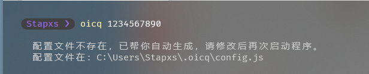
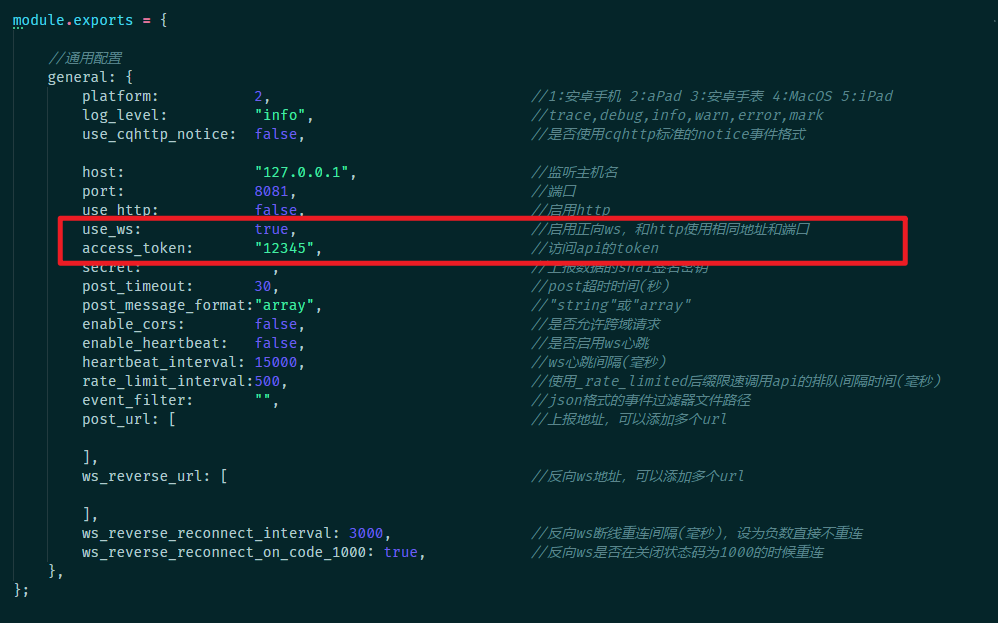
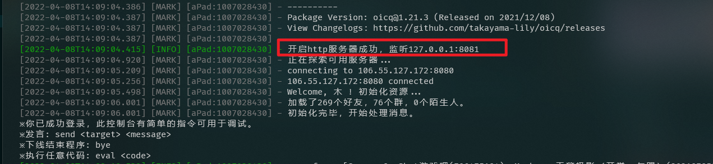
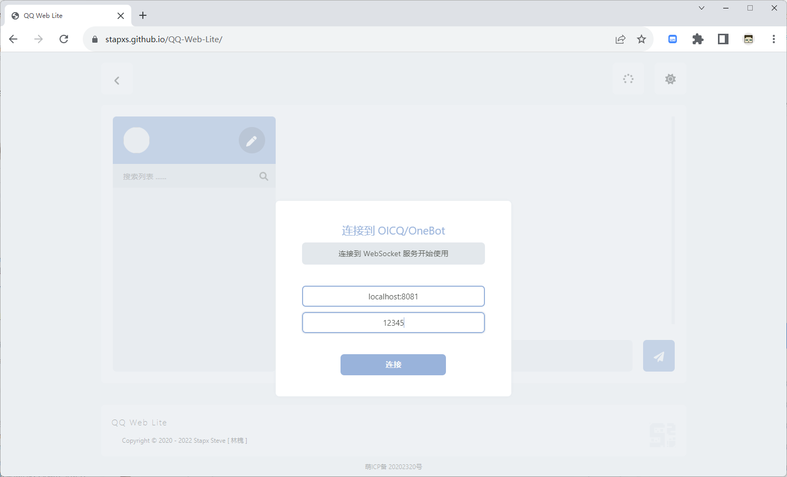
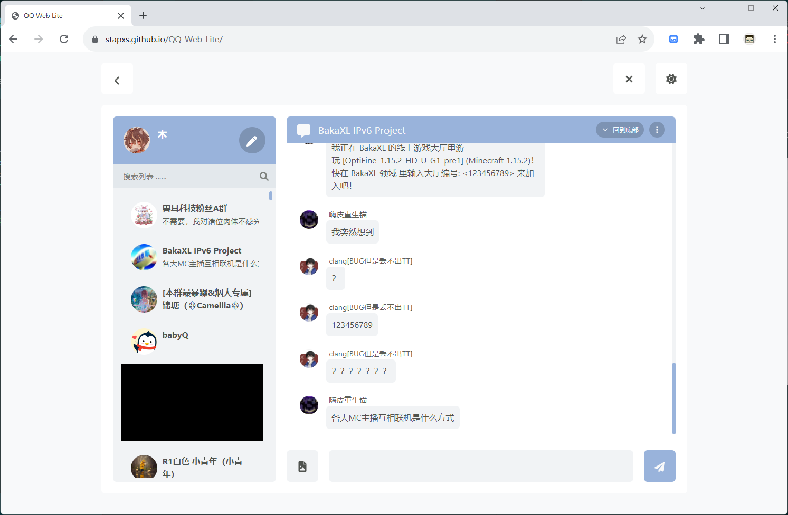

# Stapxs-QQ-Lite

    

        
        
        
    

 
 

# 部署

## Github Pages
本仓库开启了 GitHub Pages, 你可以选择直接访问本仓库的页面来使用: https://stapxs.github.io/Stapxs-QQ-Lite/

## 克隆仓库
此项目为完整的纯前端静态页面,你可以克隆仓库,非常暴力的直接打开 index.html 来使用; 但是需要注意的是部分浏览器在使用 file:// 协议的时候无法正常允许页面发起通知, 同时文件也无法唤起 PWA 功能进行 PWA APP 安装。
在 `v1.2.0` 版本之后，依赖 cookie 的功能也完全无法在文件打开时使用，敬请注意。

因为此项目是静态页面,你也可以将它部署在任何 Web 服务端或者静态页面托管服务上, 在这种情况下上面提到的问题将恢复正常。

# 使用
本程序依赖 oicq-http (v1) 作为后端服务, 关于 oicq-http 可以参考此处: https://github.com/takayama-lily/oicq/tree/master/http-api

## 部署 OICQ
你可以参考 oicq-http 的简单教程部署 oicq-http bot, 或者看下面。

1 - 运行 oicq 需要依赖 nodejs (12.16+), 确保你已经安装了 nodejs, 执行如下指令安装 oicq-http:

`npm i oicq@1 -g`

2 - 接下来使用你的 QQ 号登录 oicq:

`oicq < QQ 号 >`

3 - 首次运行将生成配置文件, 需要修改配置文件来使 Web 可以交互:

打开生成的配置文件修改一些东西, 确保启用了 ws 服务并设置了连接 token:

4 - 再次使用你的 QQ 号登录 oicq, oicq-http 应当正常启动:

## 连接 OICQ
接下来就可以打开页面连接到 oicq-http 了; 如果在本地部署了 oicq-http 直接连接本地即可, 网络服务则建议开启 wss 并连接, 此处不过多累述。

如果没有意外, Stapxs QQ Lite 将开始加载好友列表并刷新消息:

# 更多问题
### 我能使用其他 QQ Http Bot 吗
- 如果它兼容 OneBot 11 协议 (https://github.com/botuniverse/onebot-11), 你可以尝试连接它, 但是由于获取历史消息的接口是 oicq-http 独有的, 依赖此接口的部分功能 (如加载历史消息、发送消息显示) 将会无法正常工作。

### 使用 Bot 是否有封号风险
- 如果你使用的是 oicq-http, 可以查看此处了解封号风险 (https://github.com/takayama-lily/oicq/wiki/98.%E5%85%B3%E4%BA%8E%E8%B4%A6%E5%8F%B7%E5%86%BB%E7%BB%93%E5%92%8C%E9%A3%8E%E6%8E%A7), 如果你尝试使用其他 QQ Bot (参见上一条问题), 请自行参考它的文档。

### 我遇到了问题
- 如果有什么奇奇怪怪的问题, 欢迎发起 issue 询问! 如果有什么 BUG 和优化建议也可以哦! (https://github.com/Stapxs/Stapxs-QQ-Lite/issues)

 
 

    README v1.1 
    Stapx Steve [ 林槐 ] 2022 
    林槐出品, 必属稽品

